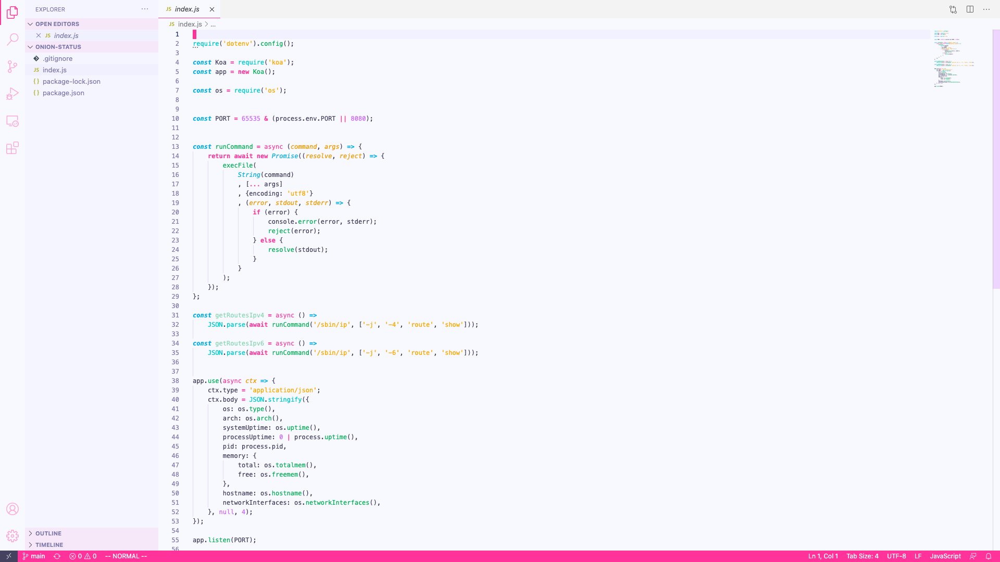
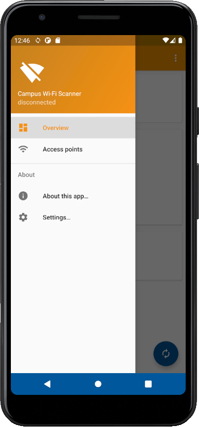

# 情報系@自治会

## #春から東大

(学部新入生向け)

**自治会はITに興味がある学生を募集しています!**

* 駒場キャンパスにある自治会室が使える!
* 活動保証費が支給!
* 学生組織なので，気軽に主体的に活動できる!
* 経験者優遇，あなたのスキルを待っている！

興味を持ったら早目にIT系事務員に応募しよう：

応募はメールでお早めに！

komaba (at) todaijichikai.org

**好評につき2021年の新入生の春の情報系事務員採用は 4月9日（金）までとさせていただいております．**

**→ 締め切りを過ぎても応募は随時受け付けています．詳細はメールでお問い合わせください．**

運営にもっと主体的に関わりたい方は，定期的に募集している理事にも立候補できます．これは応募時点で次の自治委員会での選出になります．

## 何をやっているの?

GitHub: [github.com/UTokyoStudents](https://github.com/UTokyoStudents)

### Web 開発


### スマートフォンアプリ


### システム・ネットワーク・クラウド管理
```
jp1-r1>
jp1-r1> enable
jp1-r1# 
jp1-r1# show ip route
Codes: K - kernel route, C - connected, S - static, R - RIP,
       O - OSPF, I - IS-IS, B - BGP, P - PIM, A - Babel, N - NHRP,
       > - selected route, * - FIB route

K * 0.0.0.0/0 via 10.203.1.1, ens5 inactive, src 10.203.1.171
O>* 10.197.1.0/24 [110/20] via 10.200.201.2, tap0, 4d18h21m
O>* 10.198.101.0/24 [110/20] via 10.200.201.2, tap0, 4d18h21m
O>* 10.200.101.0/24 [110/20] via 10.200.201.2, tap0, 4d18h21m
O   10.200.201.0/24 [110/10] is directly connected, tap0, 01w1d11h
C>* 10.200.201.0/24 is directly connected, tap0
C>* 10.203.1.0/24 is directly connected, ens5
K>* 10.203.1.1/32 is directly connected, ens5
C>* 127.0.0.0/8 is directly connected, lo
O>* 192.168.1.0/24 [110/20] via 10.200.201.2, tap0, 4d18h21m
O>* 192.168.23.0/24 [110/20] via 10.200.201.2, tap0, 4d18h21m
jp1-r1#
```

---
**UTokyoStudents (UTokyo Students' Portal for Information Platforms)**

Copyright &copy; 2021 [東京大学教養学部学生自治会](https://todaijichikai.org/).

Content is licensed under CC-BY 4.0 license.
